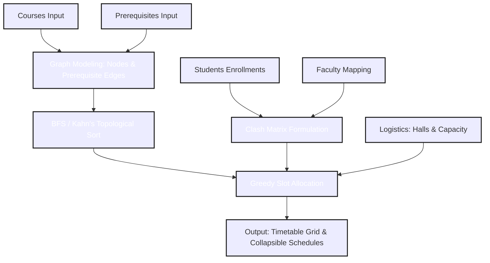

# ScheduleX : High-Performance University Exam Scheduler
### Graph-Theoretic Timetable Generator powered by C++, WebAssembly, and Neo-Brutalist UI

---

## 1. Executive Summary & Vision

**ScheduleX** is an optimized, high-performance course and exam scheduling engine designed to solve the NP-complete conflict-resolution scheduling problem. The core algorithm is written in pure C++ (offering native speeds) and compiled into **WebAssembly (WASM)** to run directly within client browsers at near-native speeds. It features a complete dual-engine architecture: a WebAssembly engine paired with a mirrored JavaScript implementation that acts as an immediate offline/unsupported-browser fallback.

The user interface follows a custom-tailored **Neo-Brutalist design language** (white backgrounds, 4px solid black borders, hard 8px drop shadows, custom scrollbars, and high-visibility statistics badges). It is built using HTML5, vanilla CSS, and Tailwind CSS, fully responsive on mobile devices and optimized for modern web performance.

---

## 2. Core Scheduling Concepts & Mathematical Model

The scheduling system is formulated using graph theory and greedy constraint satisfaction, solving three primary components: **dependency management**, **conflict prevention**, and **capacity allocation**.



### A. Graph Modeling (Prerequisites)
Courses are modeled as nodes in a **Directed Acyclic Graph (DAG)** $G = (V, E)$, where $V$ represents the set of courses and $E$ represents directed prerequisite dependencies:
$$e = (u, v) \in E \implies \text{Course } u \text{ must be scheduled in a slot strictly prior to Course } v$$

### B. Conflict / Clash Matrix
Two courses clash if they cannot be scheduled during the same exam session. ScheduleX automatically builds a symmetric boolean Clash Matrix $C$ of size $|V| \times |V|$:
$$C[u][v] = \begin{cases} 
1 & \text{if } Faculty(u) = Faculty(v) \lor \exists s \in Students \text{ s.t. } \{u, v\} \subseteq Enrollments(s) \\
0 & \text{otherwise}
\end{cases}$$

Where:
- $Faculty(u)$ represents the faculty member instructing course $u$.
- $Enrollments(s)$ represents the set of courses student $s$ is taking.

### C. Capacity & Logistics Allocation
When scheduling course $u$, the scheduler determines if the student enrollment $|Enrollments(u)|$ exceeds the capacity limit of a single hall. If:
$$\text{Enrollment}(u) > \text{HallsAvailable} \times \text{HallCapacity}$$
The scheduler triggers a validation error. If the enrollment exceeds a single hall capacity but fits across multiple halls, it assigns the course to a slot. If the course is extremely large, it splits the course into consecutive sessions (batches).

---

## 3. The Algorithmic Pipeline

The core scheduler proceeds in two sequential phases: **Topological Sorting** and **Greedy Slot Allocation**.

### Phase 1: Kahn's Algorithm for Topological Sort
To guarantee that prerequisite exams occur before dependent exams, the scheduler performs a BFS-based topological sort using Kahn's algorithm:

1. **Calculate In-degrees**: For each node $v \in V$, compute the number of incoming prerequisite edges:
   $$\text{inDegree}[v] = |\{u \in V \mid (u, v) \in E\}|$$
2. **Initialize Queue**: Place all nodes $v$ with $\text{inDegree}[v] = 0$ into a queue $Q$.
3. **Sort**: While $Q$ is not empty:
   - Dequeue a course $u$ and append it to the topological order list.
   - For each child node $v$ adjacent to $u$:
     - Decrement $\text{inDegree}[v]$.
     - If $\text{inDegree}[v] = 0$, enqueue $v$.
4. **Cycle Detection**: If the topological order list contains fewer than $|V|$ elements, a cycle exists (e.g., $A \to B \to A$), and scheduling is aborted.

```
       [Intro to Programming] (in-degree 0)
             /          \
            v            v
    [Data Structures]  [Database Systems] (in-degree 1)
            \            /
             v          v
          [Design of Algorithms] (in-degree 2)
```

### Phase 2: Greedy Slot Assignment
For each course $u$ taken in topological order:
1. Determine the earliest possible slot index $S_{min}$. If $u$ has prerequisites, $S_{min}$ must be strictly greater than the maximum slot index assigned to any of its prerequisites:
   $$S_{min} = \max_{(p, u) \in E} (\text{EndSlot}[p]) + 1$$
2. Scan potential slots $S \ge S_{min}$ sequentially:
   - Check **Clash Matrix**: Ensure that for all courses $v$ already scheduled in slot $S$, $C[u][v] = 0$.
   - Check **Hall Limitations**: Verify that the number of exam halls occupied in slot $S$ plus the batches required for $u$ does not exceed $\text{HallsAvailable}$.
3. Once a valid slot $S$ is found, assign $u$ to $S$. If $u$ is batched across $k$ sessions, it occupies slots $S, S+1, \dots, S+k-1$.

---

## 4. Technology Stack & Integration Architecture

```
+--------------------------------------------------------------------------+
|                            Neo-Brutalist HTML5 UI                        |
|                     (Tailwind CSS CDN + Google Inter Font)               |
+------------------------------------+-------------------------------------+
                                     |
                                     v
+------------------------------------+-------------------------------------+
|                              JavaScript Bridge                           |
|      (Collects form inputs, manages DOM nodes, handles page scrolls)     |
+---------------------+------------------------------+---------------------+
                      |                              |
                      | [Supports WASM]              | [WASM Failed/Offline]
                      v                              v
+---------------------+--------------------+   +-----+---------------------+
|          WebAssembly JS Wrapper          |   |      Mirrored JS Engine   |
|            (scheduler.js glue)           |   |      (Pure JS Fallback)   |
+---------------------+--------------------+   +---------------------------+
                      |
                      v
+---------------------+--------------------+
|             WASM Binary Module           |
|            (scheduler.wasm C++)          |
+------------------------------------------+
```

| Layer | Technical Details |
|---|---|
| **Core Algorithm** | Pure C++17 (zero external library dependencies, purely using standard containers like `std::vector` and `std::string` for portability). |
| **WASM Bridge** | Emscripten compiler toolkit generating a high-speed runtime interface using the Emscripten Bindings (`EMSCRIPTEN_BINDINGS`) specification. |
| **Front-End Styling** | Tailwind CSS CDN + custom Vanilla CSS properties in `style.css` (custom scrollbars, border strokes, and layout grid configurations). |
| **Icons & Typography** | Google Fonts (Inter + JetBrains Mono) + Google Material Symbols Outlined icons. |
| **CI/CD Deployment** | Automated GitHub Actions workflow compiling C++ and deploying output static files directly to GitHub Pages. |

---

## 5. File Structure & Module Map

```
scheduleX/
├── scheduler_core.hpp      ← Core C++ algorithm: pure structures and scheduling engines
├── course_scheduler.cpp    ← Native C++ CLI entry point (terminal version)
├── wasm_bridge.cpp         ← Emscripten WASM bridge: registers bindings and converts structures
├── build_wasm.sh           ← Shell compiler script for Linux and macOS environments
├── build_wasm.bat          ← Batch compiler script for Windows environments
├── docs/                   ← Front-end distribution directory (served via GitHub Pages)
│   ├── index.html          ← Single-page application UI (HTML structure & Tailwind bindings)
│   ├── style.css           ← Custom styling system: Neo-brutalist parameters & mobile overrides
│   ├── app.js              ← UI DOM operations, counts/badge handlers, and JS fallback engine
│   ├── scheduler.js        ← Emscripten-generated WebAssembly JS loader
│   └── scheduler.wasm      ← Compiled binary representation of C++ scheduling logic
├── .github/
│   └── workflows/
│       └── static.yml      ← GitHub Actions deployment workflow (publishes the docs folder)
└── README.md               ← This file
```

---

## 6. Execution & Compiling Guide

### A. Compiling and Running the Native CLI Version
To compile and run the interactive CLI terminal application:
```bash
# 1. Compile using any compiler supporting C++17
g++ -std=c++17 -O3 -o scheduler course_scheduler.cpp

# 2. Execute the CLI binary
./scheduler         # On macOS/Linux
scheduler.exe       # On Windows
```

### B. Serving the Web Version Locally
Since the browser restricts loading WebAssembly binaries (`.wasm` files) via the `file://` protocol due to CORS safety restrictions, you must serve the files using a local HTTP server:
```bash
# 1. Start a local HTTP server inside the project root
python -m http.server 8080

# 2. Open the browser
# Navigate to: http://localhost:8080/docs/index.html
```

### C. Recompiling the C++ Core to WebAssembly
To compile the C++ source code to WASM binaries using Emscripten:
1. Ensure the Emscripten compiler toolkit (`emcc`) is installed and sourced on your shell path:
   ```bash
   git clone https://github.com/emscripten-core/emsdk.git
   cd emsdk
   ./emsdk install latest
   ./emsdk activate latest
   source ./emsdk_env.sh
   ```
2. Build the output binaries:
   ```bash
   # On macOS/Linux:
   chmod +x build_wasm.sh
   ./build_wasm.sh

   # On Windows:
   build_wasm.bat
   ```
   This compiles `wasm_bridge.cpp` and outputs the compiled binary module `scheduler.wasm` along with its JS loader script `scheduler.js` directly into the `docs/` folder.

---

## 7. Custom Neo-Brutalist UI Design Tokens

ScheduleX features a highly curated, premium visual design following **Neo-Brutalist** web standards:

- **Borders & Shadows**: Features flat colors outlined with `4px solid #1a1a1a` borders and offset `8px 8px 0px 0px rgba(26,26,26,1)` hard shadows. Button hover effects utilize translation offsets (`translate(-2px, -2px)`) to mimic tactile desktop feedback.
- **Scrollable Containers**: Dynamic input cards and results list widgets are styled with scroll wrappers (`.scroll-container`) showing custom scrollbar tracks:
  - Scroll Track: `#eeeeee` with a thick `#1a1a1a` border line.
  - Scroll Thumb: `#1a1a1a` block thumb that turns deep blue (`#002fa7`) on hover.
  - Bottom Fade overlays: Gradual linear gradients highlighting when more content lies beneath.
- **Responsiveness**: Reorganized dynamically. Below `768px`, card headers stack vertically (`flex-col`) to prevent text overlaps. Timetable grids are enclosed in an overflow container (`overflow-x-auto`) to enable swipe interactions on smartphone screens.

---

## 8. Authors & Credits

- **Priyanshu Kamal** — [GitHub](https://github.com/priyanshukamal26/) · [LinkedIn](https://www.linkedin.com/in/priyanshukamal/)
